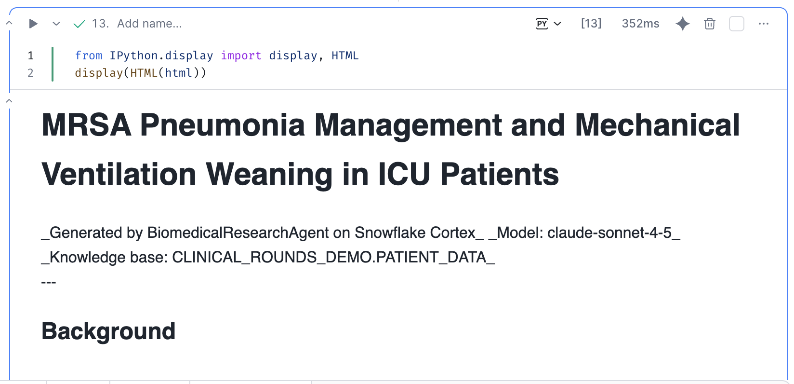
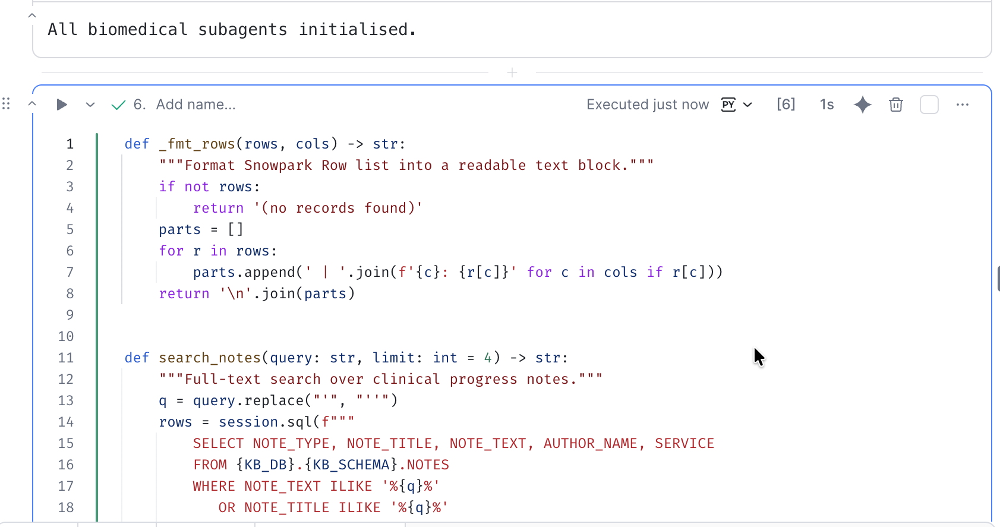
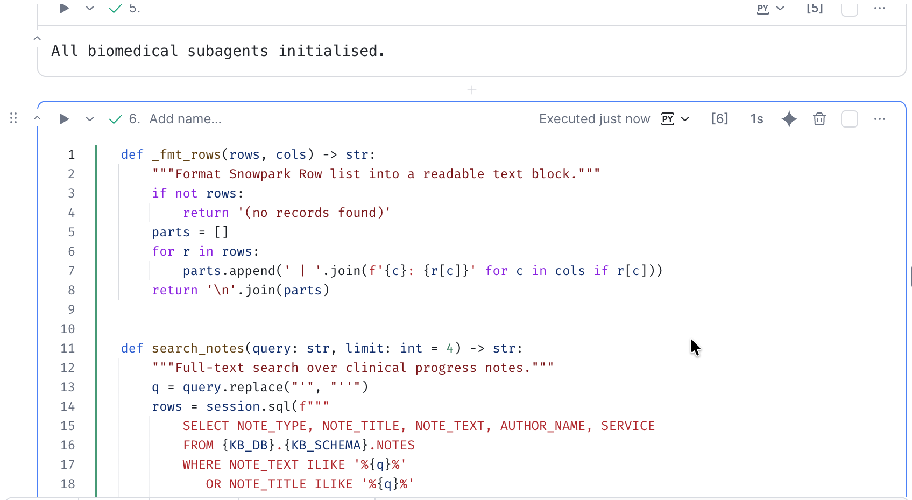
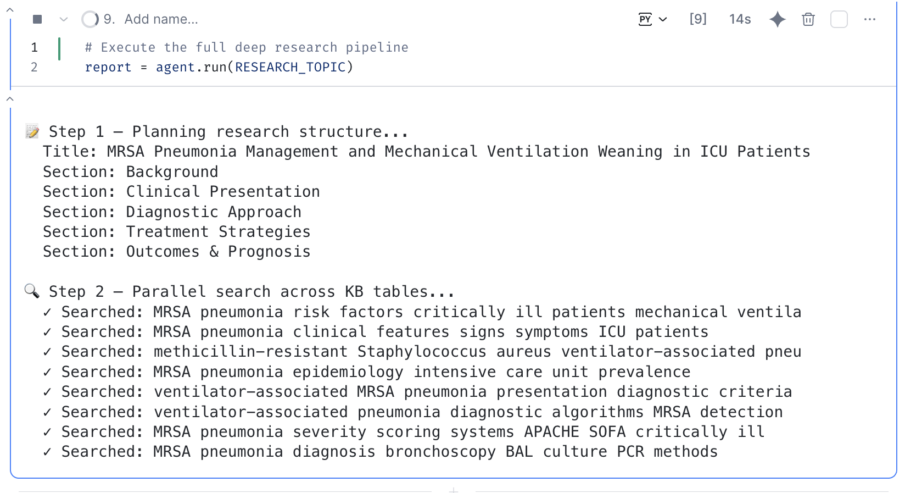
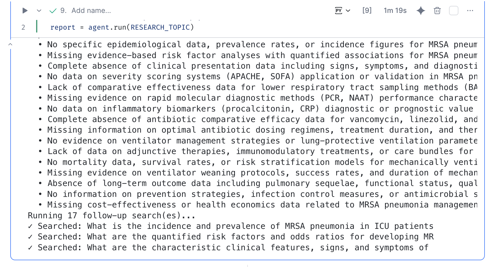
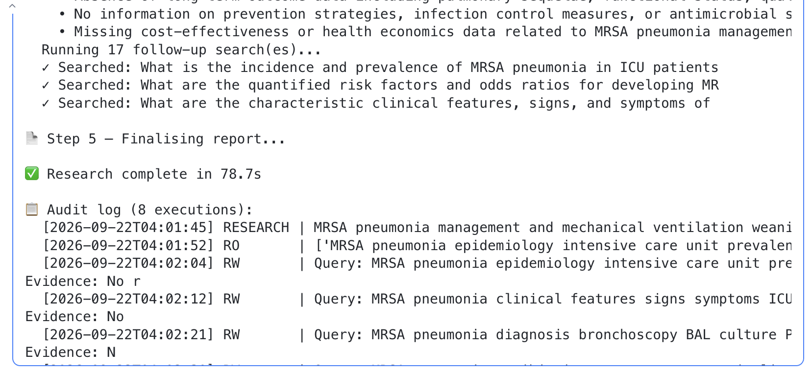
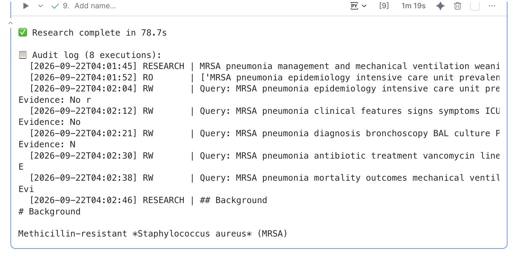
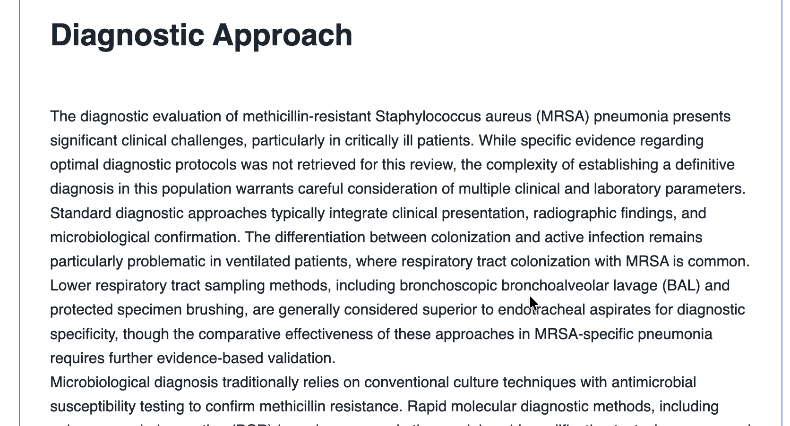
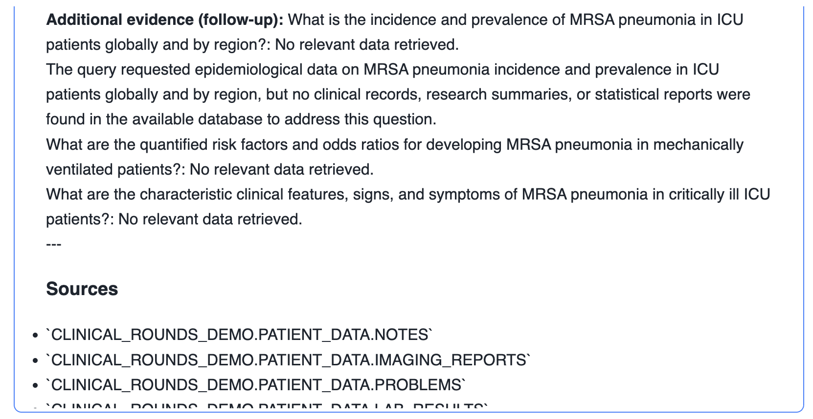
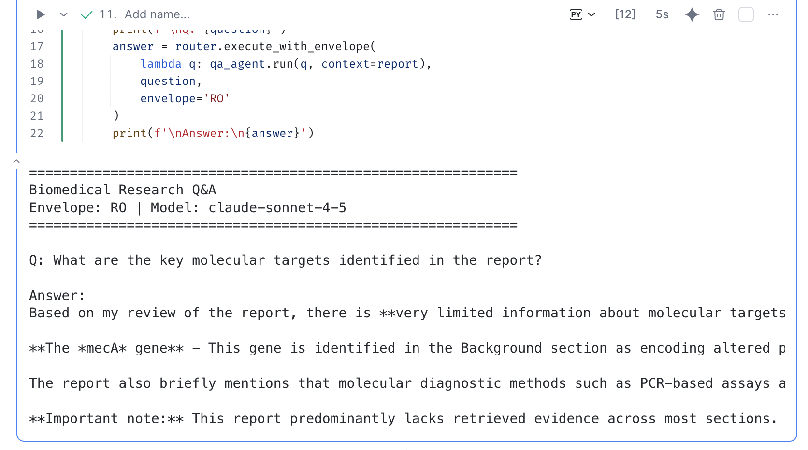

author: Priya Joseph
id: biomedical-deep-research-with-snowflake-cortex
language: en
summary: Explore biomedical research planning, clinical record retrieval, report generation, reflection, and Q&A with Snowflake Cortex.
categories: snowflake-site:taxonomy/solution-center/certification/quickstart
environments: web
status: Published
feedback link: https://github.com/Snowflake-Labs/sfguides/issues

# Biomedical Deep Research with Snowflake Cortex

## Overview

Use [BioMedDeepResearch.ipynb](BioMedDeepResearch.ipynb) to coordinate specialized Python agents for planning, evidence synthesis, writing, reflection, and report-based Q&A. The example researches MRSA pneumonia management and mechanical ventilation weaning in ICU patients.

The notebook uses Cortex-hosted Claude, not NVIDIA BioNeMo models. Screenshot filenames retain their original names.

> Educational demonstration only, not medical advice. Use approved demo data. Generated claims require qualified review against source records.

## Prerequisites

You need a Snowflake notebook environment, an available warehouse and Cortex model, permission to read the demo data, and familiarity with Python and SQL. The notebook imports Snowpark and IPython; its optional REST client also imports requests.

**The notebook does not provision data.** Supply these existing tables under the configured database and schema:

| Table | Referenced Columns |
| --- | --- |
| NOTES | NOTE_TYPE, NOTE_TITLE, NOTE_TEXT, AUTHOR_NAME, SERVICE |
| IMAGING_REPORTS | REPORT_TEXT, IMPRESSION, FINDINGS, CLINICAL_INDICATION, RADIOLOGIST_NAME |
| PROBLEMS | PROBLEM_NAME, STATUS, ONSET_DATE, PATIENT_ID |
| LAB_RESULTS | TEST_NAME, RESULT_VALUE, RESULT_UNIT, REFERENCE_RANGE, ABNORMAL_FLAG, COLLECTION_TIME |

The default schema is `CLINICAL_ROUNDS_DEMO.PATIENT_DATA`. No dataset or loading script is bundled. The example has no patient-specific filter.

## Configure the Notebook

Import the companion notebook. Update the first cell's warehouse, `MODEL`, `KB_DB`, and `KB_SCHEMA` for your environment.

For SQL-only inference, skip the REST client/test cell and backend-switch cell. Run the router and agent definitions next.

For optional REST inference, run the client/test cell and **rerun the backend-switch cell after defining the agents**. On a fresh run, the switch appears before their definitions. The router still uses SQL inference. REST compatibility and network access require separate verification; never expose session tokens.

## Initialize Agents and Test Retrieval

Run the router and agent-definition cells to initialize `PlannerAgent`, `SearchAgent`, `WriterAgent`, `ReflectorAgent`, and `QAAgent`.

Run the retrieval cell and inspect its `search_notes('pneumonia', limit=1)` smoke test before continuing.

Retrieval uses substring matching, not semantic search. Long generated phrases can return no matches. Up to four queries run concurrently; each searches the four tables sequentially. No external literature search is performed.

The router's RO/RW/RESEARCH/DEPLOY labels are application labels, **not enforced authorization**. Its in-memory execution log is not a complete security audit trail.

## Run Research

Run the orchestrator-definition cell, review `RESEARCH_TOPIC`, then execute `report = agent.run(RESEARCH_TOPIC)`.

The workflow plans sections, retrieves and summarizes records, drafts sections, and reflects on evidence gaps. A completed search does not guarantee relevant evidence.

Only the first three proposed follow-up queries run, despite the progress message displaying the full proposed count. Follow-up summaries are appended to the last section.

Finalization assembles text and a static source-table list; it does not deploy a service.

## Review the Report and Ask Questions

Inspect `report`, then run the HTML-generation cell and final display cell. The HTML converter is minimal and does not sanitize arbitrary HTML; do not render untrusted content or publish output without review.

The screenshots contain missing evidence alongside general medical statements. They illustrate workflow behavior, not validated clinical conclusions. The source-table footer is not record-level citation.

Edit the Q&A cell's `questions` list and run it after generating the report. Answers use the report, without fresh retrieval.

## Conclusion

You explored planning, retrieval, synthesis, reflection, reporting, and Q&A. Before broader use, add reproducible dataset setup, reliable retrieval, record-level citations, independent authorization, sanitized rendering, and qualified evaluation of generated claims.
